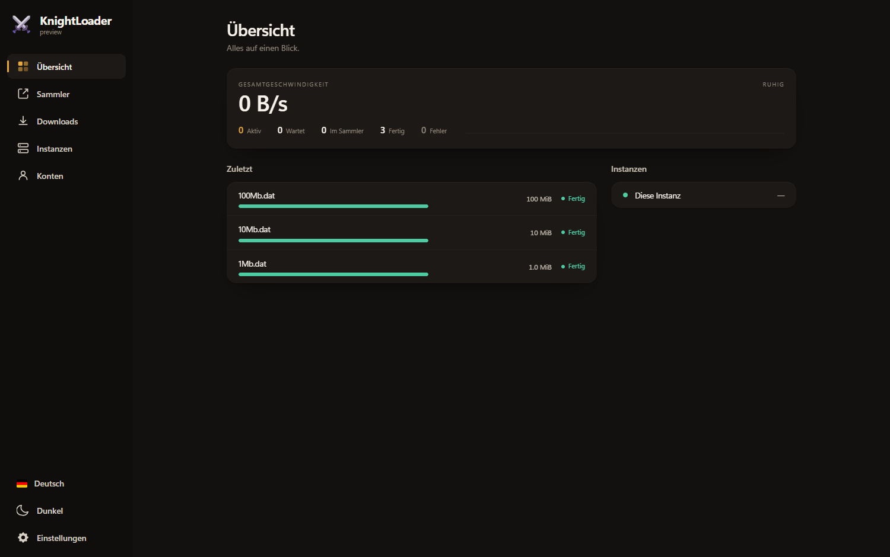
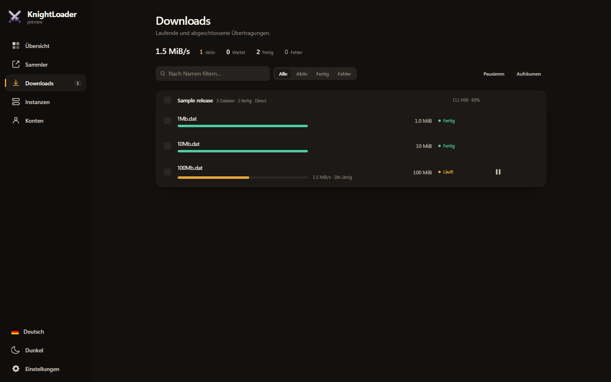
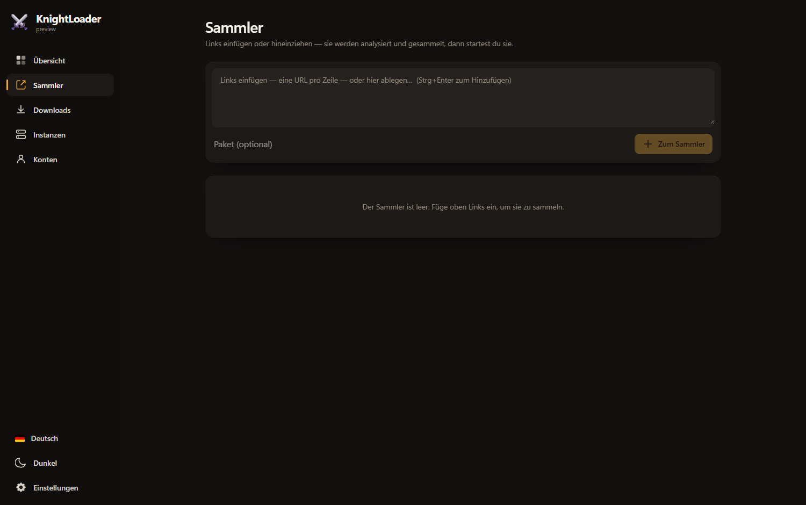
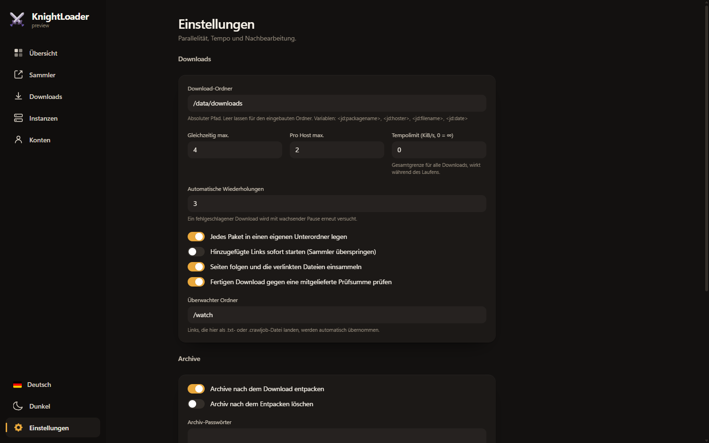

<h1 align="center">KnightLoader</h1>

<p align="center">
  <a href="https://github.com/junkerderprovinz/knightloader/actions/workflows/ci.yml"></a>&nbsp;
  <a href="https://go.dev"></a>&nbsp;
  <a href="https://react.dev"></a>&nbsp;
  &nbsp;
  &nbsp;
  <a href="LICENSE"></a>
</p>

<br>

<p align="center">
A self-hosted, cross-platform download manager: a clean-UI alternative to JDownloader that grabs files from everywhere and hauls them into one keep. One Go binary with the download engine, the API and the web UI inside it, shipped as a container and as native desktop apps.
</p>

<br>

<p align="center">
  <a href="https://buymeacoffee.com/junkerderprovinz">
    
  </a>
</p>

<br>

> **Working title.** The name, the logo and the first release are not settled
> yet. Everything below is built and runs; the branding is what is missing.

<br>

## Table of Contents

1. [Overview](#1-overview)
2. [Screenshots](#2-screenshots)
3. [Quick Start](#3-quick-start)
4. [Configuration](#4-configuration)
5. [Getting links in](#5-getting-links-in)
6. [Where files land](#6-where-files-land)
7. [Architecture](#7-architecture)
8. [Development](#8-development)
9. [Contributing and license](#9-contributing-and-license)
10. [Support this project](#10-support-this-project)

<br>

## 1. Overview

KnightLoader is one Go process. The download engine, the REST and WebSocket API,
the web UI and the Click'n'Load listener all live in the same binary, so there is
no aria2 to supervise, no separate front end to keep in step, and nothing to
install beside it.

Hoster coverage comes from swappable **resolvers** rather than from a plugin
ecosystem nobody can maintain: plain file links go straight to the embedded
engine, supported hosters are unlocked through a debrid service you already pay
for, media pages go to yt-dlp, and anything left over is delegated to a headless
JDownloader kept at arm's length. Your accounts stay yours, stored encrypted on
your own box.

**What's included**

| | |
|---|---|
| **Collector** | Links are analysed and staged before anything downloads: name, size, availability, which backend will take them. Nothing is ever dropped in silence, and a link that no backend handles is still shown, with the reason on it. |
| **Rules** | A Packagizer and a link filter, one engine used twice: match on filename, URL, hoster, source, type or size, then set the package, folder, filename, priority or comment — or refuse the link, with the rule's name attached. A test box shows what a rule would do before it does it. |
| **Download list** | A real table: choose your columns, resize and reorder them, sort by any of them, fold packages away. The layout is remembered per instance, and sorting is a view — the queue keeps its own order. |
| **Crawling** | Paste a page and it becomes the files it links to, not one unusable task. |
| **Containers** | `.txt` link lists are read here. `.dlc`, `.ccf` and `.rsdf` are handed to the JDownloader backend, which holds the key that opens them — their contents then come back through the ordinary path, so the filter and the Packagizer apply to them like anything else. |
| **Queue** | Global and per-host concurrency, priorities, manual order, a stop mark, automatic retries with a growing delay, and a timetable that pauses or throttles by the clock. |
| **Speed limit** | A total for everything, applied while downloads run rather than only to the next one. |
| **Duplicates** | The same URL twice is refused; the same file under two URLs is recognised as a mirror, under a policy you pick rather than a guess. Refused links are held with their reason, not deleted. |
| **Extraction** | zip, rar (incl. multi-volume), 7z, tar, gz, bz2, xz, zst. A multi-part set waits for every part. Encrypted rar and 7z take passwords. |
| **Integrity** | A finished file is checked against an `.sfv`/`.md5`/`.sha*` that came with it, or a CRC in its own name. Nothing is marked as passing that was not checked. |
| **Collisions** | What happens when the file already exists is your choice — overwrite, skip or number it — and the name is reserved atomically, so two downloads finishing together cannot pick the same one. |
| **Connections** | Several outbound routes with order, credentials and a per-host filter, handed out round-robin up to a cap each. Passwords are stored, never served back. |
| **Reconnect** | Get a new address when a hoster's limit is keyed to the one you have, by running a command or replaying a recorded HTTP exchange — and an unchanged address counts as a failure, not a success. |
| **Intake** | Paste, drop, [Click'n'Load](docs/clicknload.md) from a site's own button, a container file, or a watched folder for `.txt` and `.crawljob` files. |
| **Multi-instance** | Register other KnightLoaders and drive them all from one dashboard. Self-hosted federation, no relay. |
| **Access** | An optional password lock, off by default. Same-origin API, origin-checked WebSocket. |
| **Languages** | 42, each fetched only when chosen, right-to-left included. |

<br>

## 2. Screenshots

<p align="center">
  
  <br><em>Overview: one number that matters, and what is happening under it.</em>
</p>

<br>

<p align="center">
  
  <br><em>Downloads, grouped by package, with selection and queue order.</em>
</p>

<br>

<p align="center">
  
  <br><em>The collector: paste or drop, see what you got, then start it.</em>
</p>

<br>

<p align="center">
  
  <br><em>Settings, split into the three decisions they actually are.</em>
</p>

<br>

## 3. Quick Start

```sh
go run ./cmd/knightloader      # then open http://localhost:8749
```

<details>
<summary><b>Docker</b></summary>

The repository is private, so the image is built where it runs rather than
pulled from a registry:

```sh
docker build --build-arg VERSION=preview -t knightloader:preview .

docker run -d --name knightloader \
  --restart unless-stopped \
  -p 8749:8749 \
  -v /path/to/appdata:/data \
  -v /path/to/downloads:/data/downloads \
  -v /path/to/watch:/watch \
  -e TZ=Europe/Berlin \
  knightloader:preview
```

On Unraid add `--user 99:100` so finished files land as `nobody:users`, and see
[docs/preview-deploy.md](docs/preview-deploy.md) for the rest.
</details>

<br>

## 4. Configuration

Everything is optional and has a working default.

| Var | Default | Meaning |
|---|---|---|
| `KL_ADDR` | `:8749` | listen address |
| `KL_DATA` | user config dir | data directory (database, settings, accounts, session key) |
| `KL_YTDLP` | `yt-dlp` (PATH) | path to the yt-dlp binary; media links route through it when present |
| `KL_TORBOX` | | TorBox API key. The Accounts page is the better place: it stores the key encrypted and applies it without a restart |
| `KL_ALLDEBRID` | | AllDebrid API key, as above |
| `KL_REALDEBRID` | | Real-Debrid API token, as above |
| `KL_JD` | | headless JDownloader API URL, e.g. `http://jd:3128`; the catch-all for hoster links nothing else claims |
| `KL_CNL` | `9666` | Click'n'Load listener port on `127.0.0.1`; `0` disables it |
| `KL_PROVISION_JD` | `0` | `1` provisions a private headless JDownloader on first run and uses it as the hoster backup |

<br>

## 5. Getting links in

Pasting works, and so does dropping text onto the collector. Beyond that:

- **[Click'n'Load](docs/clicknload.md)** — a site's own CnL button hands its links
  straight over. When KnightLoader runs on a NAS the same binary doubles as a
  bridge on your desktop, because every site addresses `127.0.0.1` and a
  container's loopback is not the browser's:
  `knightloader -bridge http://nas:8749`
- **Watched folder** — drop a `.txt` or a JDownloader `.crawljob` onto a share and
  the box picks it up, with its package name, destination and archive password.
  Point Settings at the folder to switch it on.
- **A page** — paste one, and the files it links to are staged instead.
- **A container file** — upload a `.txt`, `.dlc`, `.ccf` or `.rsdf`. A link list is
  read on the spot. The encrypted formats cannot be opened by anyone offline —
  their key is issued to registered clients — so they are handed to the
  JDownloader backend, which has one. Without `KL_JD` set, a container is
  recognised and refused with that as the reason rather than a vague failure.

<br>

## 6. Where files land

The download folder may be a plain path or a template:

```
/downloads/<jd:date>/<jd:hoster>/<jd:packagename>
```

Available: `<jd:packagename>`, `<jd:hoster>`, `<jd:filename>`, `<jd:date>`,
`<jd:year>`, `<jd:month>`, `<jd:day>` and `<jd:simpledate:FORMAT>` with the
usual `yyyy MM dd HH mm ss SSS` pattern letters. A task can also carry its own
folder, which always wins — and a Packagizer rule can set one per link, which is
how one paste lands in several places.

Two variables differ from JDownloader on purpose, and the variables menu says so
next to each: `<jd:source:N>` here is the **Nth path segment of the source URL**,
which is what a rule with no regular expression in it can use. JDownloader's
meaning — capture group N — is `<jd:match:FIELD:N>`, which reads a group from any
field the rule matched on, not only the source. A rule naming a group on a field
it has no `matches` condition for is refused when you save it, rather than
quietly producing the wrong folder.

<br>

## 7. Architecture

```
                    +------------------------------------------+
  browser --------> |  api      REST + WebSocket + embedded UI  |
  CnL button -----> |  cnl      127.0.0.1:9666                  |
  dropped file ---> |  watch    .txt / .crawljob                |
                    +--------------------+---------------------+
                                         |
                              +----------v----------+
                              |  app                |  tasks, scheduler,
                              |                     |  packages, retries
                              +----------+----------+
                                         |
              +--------------+-----------+-----------+--------------+
              |              |           |           |              |
        +-----v-----+  +-----v-----+ +---v----+ +----v-----+  +-----v-----+
        | crawler   |  | resolver  | | engine | | extract  |  | checksum  |
        | page ->   |  | direct    | | Gopeed | | zip rar  |  | sfv md5   |
        | files     |  | debrid    | | + rate | | 7z tar   |  | sha crc   |
        |           |  | yt-dlp    | |  limit | | gz xz    |  |           |
        |           |  | headless  | |  proxy | | bz2 zst  |  |           |
        |           |  | JD        | |        | |          |  |           |
        +-----------+  +-----------+ +--------+ +----------+  +-----------+
```

The rate limit lives in a loopback proxy because the embedded engine offers no
hook for one. Everything else is a plain Go package with its own tests.

<br>

## 8. Development

```sh
go test ./... -count=1        # server
cd web && npm ci && npx tsc --noEmit && npm run build
```

The UI is built into `web/dist`, which is committed and embedded into the
binary, so a plain `go build` produces a working server. English is the source
locale and every other one is typed against it, which makes `tsc` the gate that
catches a missing or stray translation key.

<br>

## 9. Contributing and license

[AGPL-3.0](LICENSE). Own code; the name and branding are reserved.

Built on [Gopeed](https://github.com/GopeedLab/gopeed) (download engine),
[yt-dlp](https://github.com/yt-dlp/yt-dlp) (media),
[JDownloader](https://jdownloader.org/) (hoster catch-all, via its local API),
[Wails](https://github.com/wailsapp/wails) (desktop) and
[React](https://react.dev) with [Tailwind](https://tailwindcss.com).

<br>

## 10. Support this project

If this saves you time or a debug night, consider buying me a coffee:

<p align="center">
  <a href="https://buymeacoffee.com/junkerderprovinz">
    
  </a>
</p>
