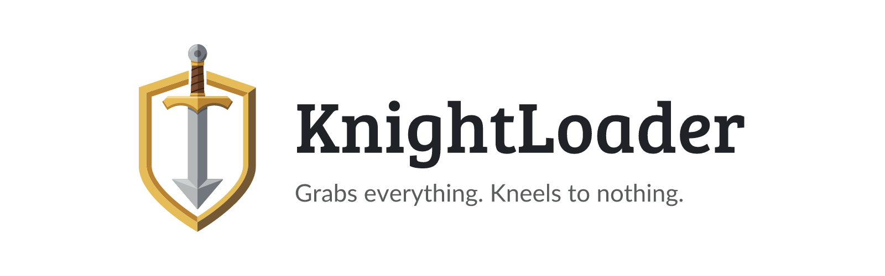
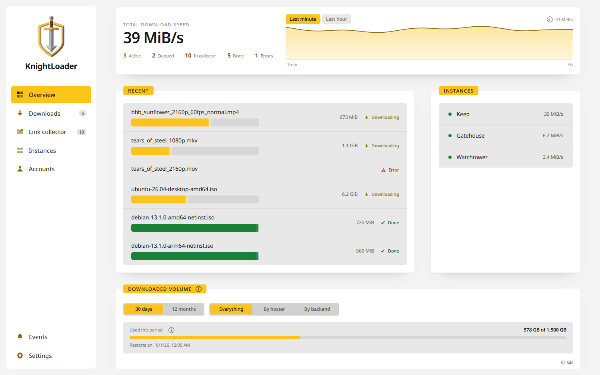
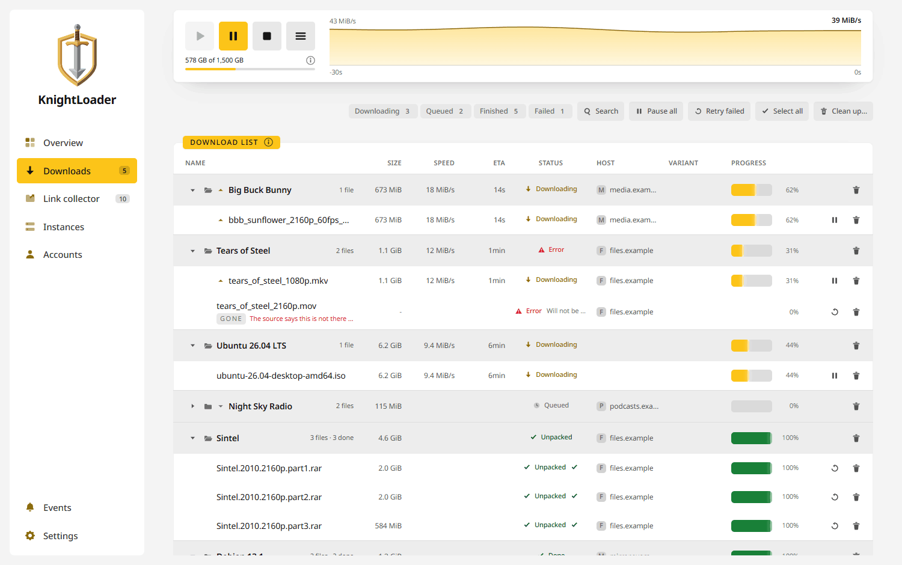
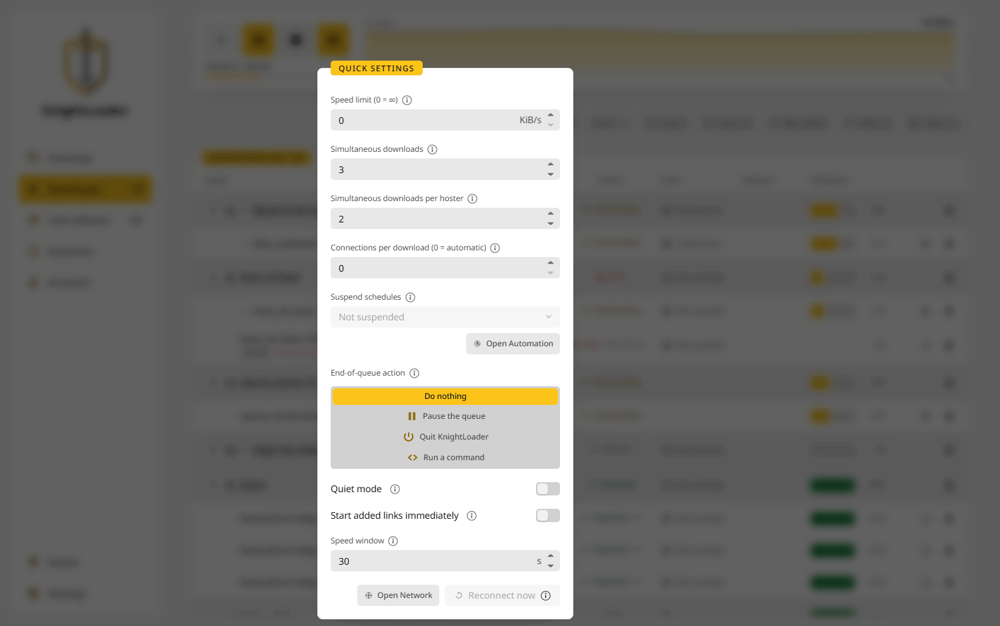
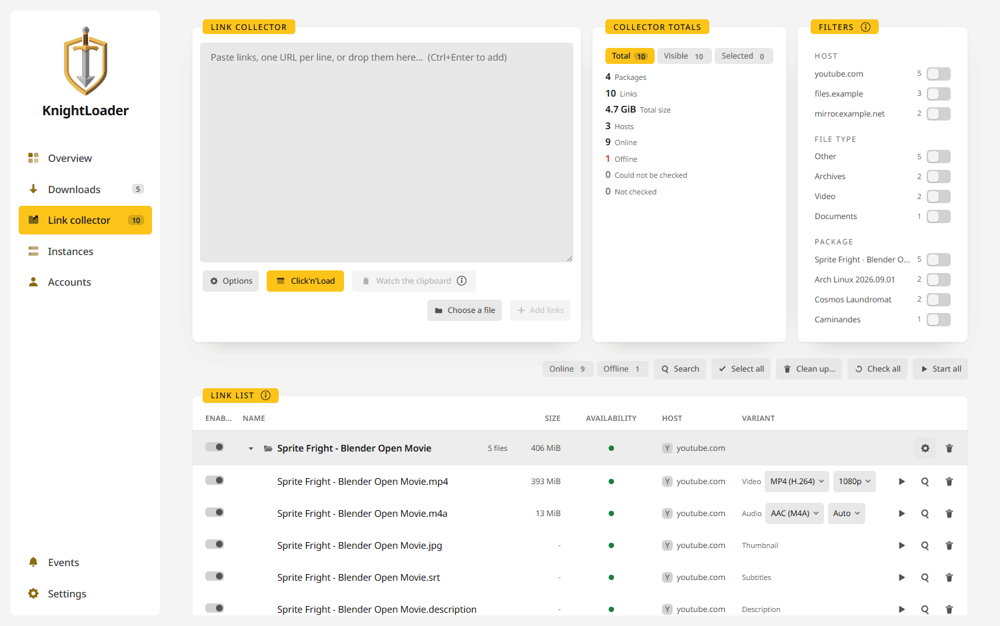
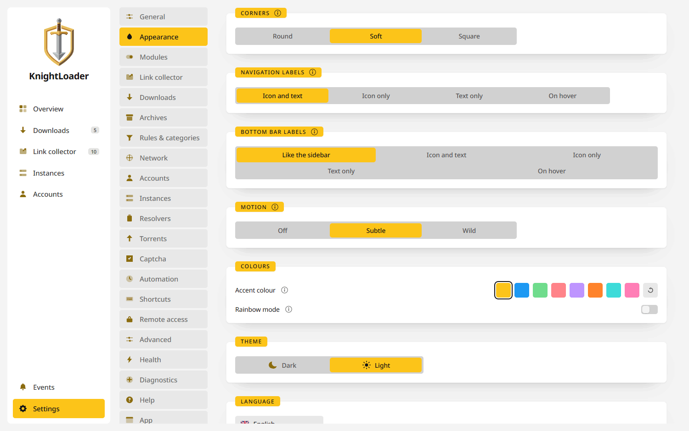
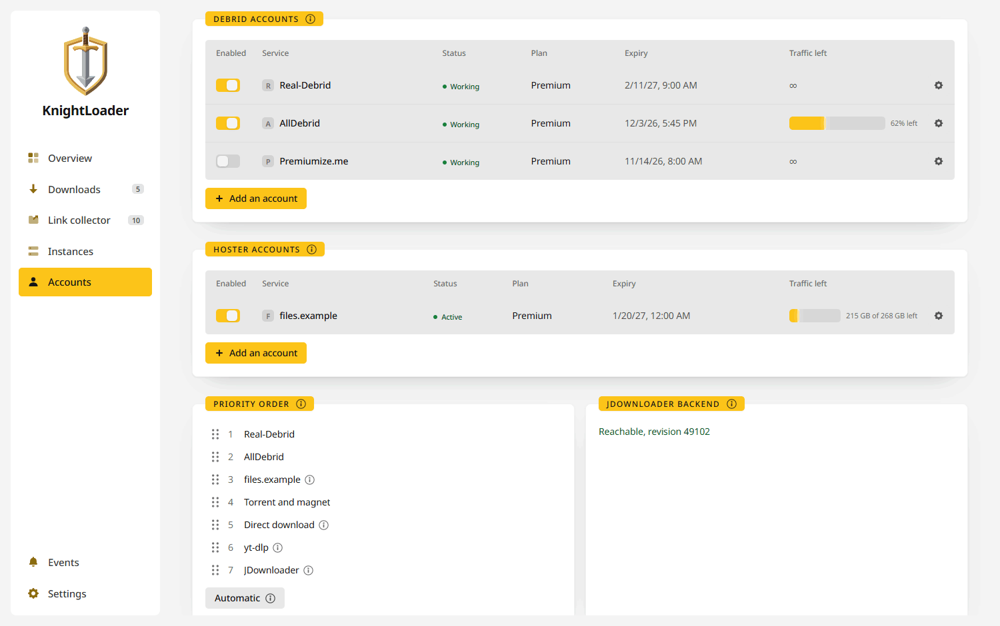
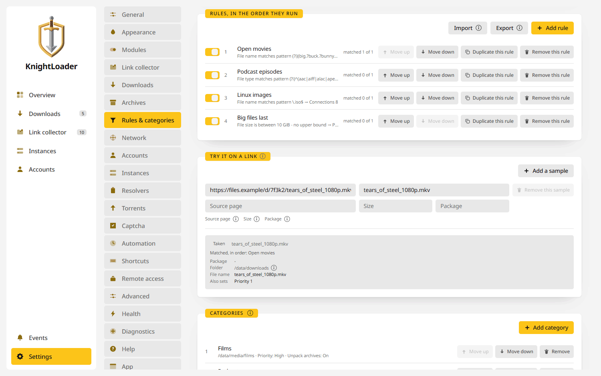
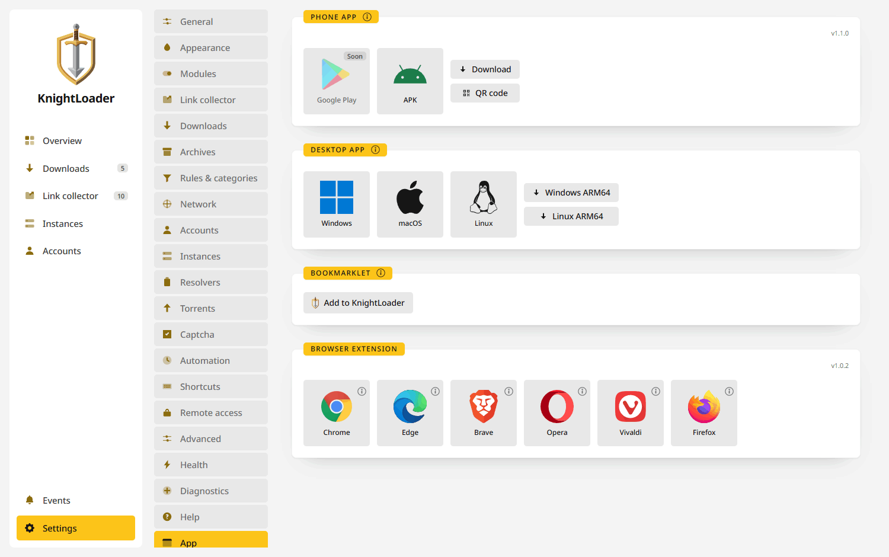
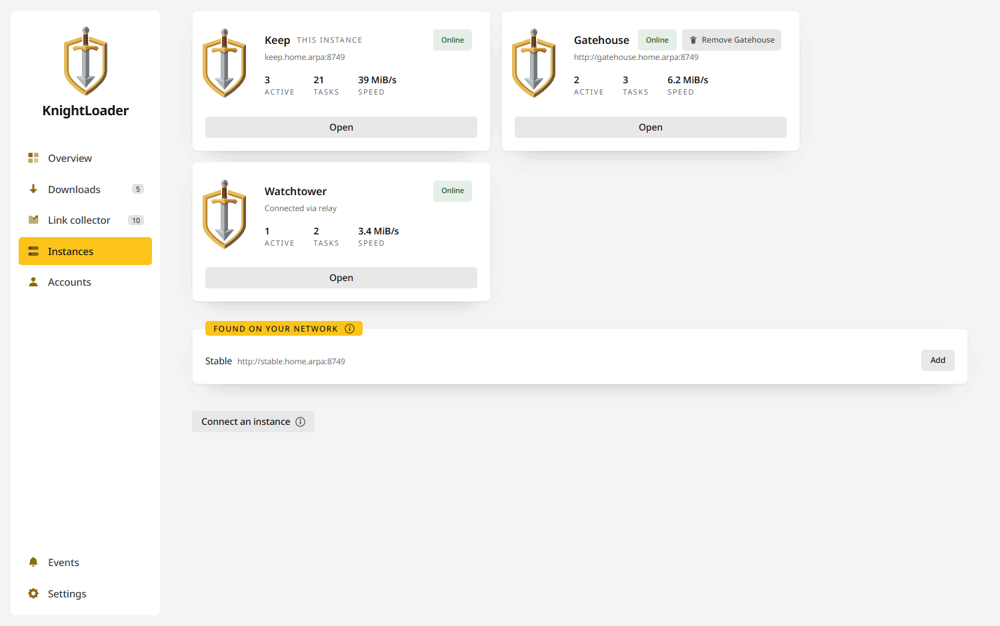

<p align="center">
  <picture>
    <source media="(prefers-color-scheme: dark)" srcset=".github/assets/knightloader-banner-dark.png">
    
  </picture>
</p>

<br>

<p align="center">
  <a href="https://github.com/junkerderprovinz/knightloader/actions/workflows/ci.yml"></a>&nbsp;
  <a href="https://go.dev"></a>&nbsp;
  <a href="https://react.dev"></a>&nbsp;
  &nbsp;
  &nbsp;
  <a href="LICENSE"></a>
</p>

<br>

<p align="center">
A self-hosted, cross-platform download manager: a clean-UI alternative to JDownloader that grabs files from everywhere and hauls them into one keep. One Go binary with the download engine, the API and the web UI inside it, shipped as a container and as native desktop apps.
</p>

<br>

<!-- download-buttons: written by scripts/gen_download_buttons.py -->
<p align="center">
  <a href="https://github.com/junkerderprovinz/knightloader/releases/latest/download/knightloader-windows-amd64.zip"></a><a href="https://github.com/junkerderprovinz/knightloader/releases/latest/download/knightloader-windows-arm64.zip"></a>
  &nbsp;
  <a href="https://github.com/junkerderprovinz/knightloader/releases/latest/download/knightloader-macos-universal.zip"></a>
  &nbsp;
  <a href="https://github.com/junkerderprovinz/knightloader/releases/latest/download/knightloader-linux-amd64.zip"></a><a href="https://github.com/junkerderprovinz/knightloader/releases/latest/download/knightloader-linux-arm64.zip"></a>
</p>
<p align="center">
  <a href="https://github.com/junkerderprovinz/knightloader/pkgs/container/knightloader"></a>
  &nbsp;
  <a href="https://github.com/junkerderprovinz/knightloader/releases/latest"></a>
  &nbsp;
  <a href="https://junkerderprovinz.github.io/knightloader/"></a>
</p>
<p align="center">
  <a href="https://github.com/junkerderprovinz/knightloader/releases/download/mobile/latest/knightloader-android.apk"></a>
  &nbsp;
  <a href="https://github.com/junkerderprovinz/knightloader/releases/download/extension/latest/knightloader-extension.zip"></a>
  &nbsp;
  <a href="https://github.com/junkerderprovinz/knightloader/releases/download/extension/latest/knightloader-extension.xpi"></a>
  <br><sub>Always the latest build</sub>
</p>
<!-- /download-buttons -->

<br>

<p align="center">
A one-knight job: I build it, keep it running, work through the issues and add what people ask for, until nothing is missing. It is free, with no accounts, no telemetry, no ads and no paid tier. No asterisk anywhere. Nothing readable ever leaves your own walls. Forged on evenings and weekends, with heart and stubbornness.
</p>

<p align="center">
If it has earned a place on your server or computer, toss a coin to your knight: it helps cover the costs and keeps the project alive. It also makes this knight's heart beat a little faster. Three ways below, whichever suits you.
</p>

<!-- give-buttons: written by scripts/gen_download_buttons.py -->
<p align="center">
  <a href="https://buymeacoffee.com/junkerderprovinz"></a>
  &nbsp;
  <a href="https://www.paypal.com/donate/?hosted_button_id=76FVV52TKXTUS"></a>
  &nbsp;
  <a href="https://junkerderprovinz.github.io/junkerderprovinz/"></a>
</p>
<!-- /give-buttons -->

<br>

<div align="center">

> # ⚠️ Under development: please do not install this yet
>
> **KnightLoader is not ready for anyone to run.** This repository is public so
> the work can be followed and the browser extension can go through store
> review.
>
> The releases, the container image and the downloads above exist so the builds
> can be tested. KnightLoader is **not listed in Community Applications** yet. What
> is here changes daily, including things that will break an existing setup without a migration path:
> the storage format, the settings document, and the wire protocol instances
> use to reach each other.
>
> **If you install it now, expect to lose your configuration and your queue.**
> Nothing here is supported, and no upgrade path is promised yet.
>
> Watch the repository if you want to know when that changes.

</div>

<br>

## Table of Contents

1. [Overview](#1-overview)
   - [How it compares](#how-it-compares)
2. [Screenshots](#2-screenshots)
3. [Quick Start](#3-quick-start)
4. [Documentation](#4-documentation)
5. [Contributing and license](#5-contributing-and-license)
6. [How AI is used here](#6-how-ai-is-used-here)
7. [Support this project](#7-support-this-project)

<br>

## 1. Overview

KnightLoader is one Go process. The download engine, the REST and WebSocket API,
the web UI and the Click'n'Load listener all live in the same binary, so there is
no aria2 to supervise, no separate front end to keep in step, and nothing to
install beside it.

Hoster coverage comes from swappable **resolvers** rather than from a plugin
ecosystem nobody can maintain: plain file links go straight to the embedded
engine, supported hosters are unlocked through a debrid service you already pay
for, magnets and `.torrent` files go to the BitTorrent client in the same
engine, media pages go to yt-dlp, and anything left over is delegated to a
headless JDownloader kept at arm's length. Your accounts stay yours, stored
encrypted on your own box.

The Packagizer, extraction, reconnect, the twelve words and everything else are
listed area by area under
[What it does](https://junkerderprovinz.github.io/knightloader/features/).

<br>

### How it compares

The table sets KnightLoader beside the programs people usually weigh it
against. Every cell about another program comes from that program's own
documentation, source code or forum as it stood in September 2026; if one has
changed since, please open an issue. KnightLoader's column describes the code in this
repository, which is not ready to install yet (see the notice at the top).

| | **KnightLoader** | [JDownloader 2](https://jdownloader.org/) | [pyLoad](https://pyload.net/) | [rdt-client](https://github.com/rogerfar/rdt-client) |
|---|:---:|:---:|:---:|:---:|
| Stable release | ❌ in development | ✅ | ❌ pre-release | ✅ |
| Open source | ✅ AGPL-3.0 | ⚠️ GPL-3.0, [a few parts closed](https://board.jdownloader.org/showthread.php?p=517795#post517795) | ✅ AGPL-3.0 | ✅ MIT |
| Runs without a runtime to install | ✅ one Go binary | ⚠️ Java, bundled on Windows and macOS | ❌ Python 3.9 or newer | ❌ .NET 10 |
| Web interface | ✅ | ⚠️ only through my.jdownloader.org | ✅ | ✅ |
| Desktop app for Windows, macOS and Linux | ✅ | ✅ | ❌ | ❌ |
| Own Docker image | ✅ amd64, arm64 | ⚠️ from the community | ⚠️ LinuxServer.io's | ✅ amd64, arm64, armhf |
| Reachable from other networks without an account | ✅ twelve words and a relay | ❌ MyJDownloader needs an account | ⚠️ expose it yourself | ⚠️ expose it yourself |
| Debrid services | ✅ several, in your order | ✅ as multihoster accounts | ✅ one plugin each | ✅ one of five, required |
| File hoster links | ⚠️ through debrid or its own JDownloader | ✅ over a thousand plugins | ✅ hundreds of plugins | ❌ |
| Premium hoster logins | ⚠️ used by that JDownloader | ✅ | ✅ | ❌ |
| Video sites | ✅ every site yt-dlp reads | ✅ plugins for many | ⚠️ a few, such as YouTube | ❌ |
| Torrents | ✅ built-in client | ❌ | ⚠️ through debrid or Transmission | ✅ through the debrid service |
| Usenet | ❌ | ⚠️ basic, no par2 repair | ⚠️ through TorBox | ⚠️ through TorBox or Premiumize |
| Click'n'Load | ✅ also to another machine | ✅ also through MyJDownloader | ⚠️ an addon, off by default | ❌ |
| Browser extension | ✅ Chromium browsers and Firefox | ⚠️ none for current Chrome | ⚠️ third-party | ⚠️ third-party |
| Phone app | ✅ Android | ✅ Android, iOS from a third party | ✅ Android, on F-Droid | ❌ |
| Captchas answered in the app or browser | ✅ | ✅ | ✅ | ➖ |
| Captchas answered on the phone | ❌ | ✅ | ✅ | ➖ |
| Paid captcha solvers | ✅ 2Captcha, Anti-Captcha | ✅ | ✅ | ➖ |
| Unpacking | ✅ no outside tools | ✅ | ⚠️ calls unrar and 7z | ✅ |
| Rules for links and packages | ✅ with a test box | ✅ Packagizer, link filter | ⚠️ words in the link | ⚠️ patterns and a minimum size |
| Scripts on events | ✅ JavaScript in a sandbox | ✅ Event Scripter | ✅ outside scripts | ⚠️ when a torrent finishes |
| Sonarr and Radarr | ⚠️ SABnzbd's API, for link lists | ❌ | ❌ | ✅ qBittorrent's and SABnzbd's API |

✅ yes · ⚠️ with a catch, named in the cell · ❌ no · ➖ does not apply: the debrid service fetches everything, so there is nothing to solve

The others are ahead in places. JDownloader and pyLoad bring hoster plugins of
their own, where KnightLoader leaves file hosters to a debrid service or to
JDownloader. JDownloader downloads from Usenet by itself, and JDownloader and
rdt-client ship stable releases. rdt-client is made for Sonarr and Radarr and
speaks qBittorrent's API for torrents as well as SABnzbd's for NZB files.

KnightLoader puts debrid services, JDownloader's hosters, torrents and yt-dlp
behind one web interface. Its phone app, its browser extension and your other
instances reach it from other networks with the twelve words, without an
account.

<br>

## 2. Screenshots

Each picture follows your system's light or dark setting. The downloads, hosts
and accounts in them are made up.

<p align="center">
  <picture>
    <source media="(prefers-color-scheme: dark)" srcset=".github/assets/screenshots/knightloader-1-overview-dark.png">
    
  </picture>
  <br><em>Overview: one number that matters, and what is happening under it.</em>
</p>

<br>

<p align="center">
  <picture>
    <source media="(prefers-color-scheme: dark)" srcset=".github/assets/screenshots/knightloader-2-downloads-dark.png">
    
  </picture>
  <br><em>Downloads, grouped by package, under the queue controls and the speed curve.</em>
</p>

<br>

<p align="center">
  <picture>
    <source media="(prefers-color-scheme: dark)" srcset=".github/assets/screenshots/knightloader-3-quick-settings-dark.png">
    
  </picture>
  <br><em>Quick settings: the limits you change most often, one click from the download list.</em>
</p>

<br>

<p align="center">
  <picture>
    <source media="(prefers-color-scheme: dark)" srcset=".github/assets/screenshots/knightloader-4-collector-dark.png">
    
  </picture>
  <br><em>The link collector: one YouTube link as video, audio, thumbnail, subtitles and description. Format and quality are picked on the row.</em>
</p>

<br>

<p align="center">
  <picture>
    <source media="(prefers-color-scheme: dark)" srcset=".github/assets/screenshots/knightloader-5-appearance-dark.png">
    
  </picture>
  <br><em>Appearance: corners, labels, motion, colours and the theme.</em>
</p>

<br>

<p align="center">
  <picture>
    <source media="(prefers-color-scheme: dark)" srcset=".github/assets/screenshots/knightloader-6-accounts-dark.png">
    
  </picture>
  <br><em>Accounts: debrid services and hoster logins, and the order they are asked in.</em>
</p>

<br>

<p align="center">
  <picture>
    <source media="(prefers-color-scheme: dark)" srcset=".github/assets/screenshots/knightloader-7-rules-dark.png">
    
  </picture>
  <br><em>Rules &amp; categories: rules sort links as they arrive, and the test box shows what they would do to one.</em>
</p>

<br>

<p align="center">
  <picture>
    <source media="(prefers-color-scheme: dark)" srcset=".github/assets/screenshots/knightloader-8-app-dark.png">
    
  </picture>
  <br><em>The App tab: the phone app, the desktop builds, the bookmarklet and the browser extension.</em>
</p>

<br>

<p align="center">
  <picture>
    <source media="(prefers-color-scheme: dark)" srcset=".github/assets/screenshots/knightloader-9-instances-dark.png">
    
  </picture>
  <br><em>Instances: your other KnightLoaders, at home or through the relay, and the ones found on your network.</em>
</p>

<br>

## 3. Quick Start

Every release tag publishes `ghcr.io/junkerderprovinz/knightloader` for amd64
and arm64 (see the notice above before you run it):

```sh
docker run -d --name knightloader \
  --restart unless-stopped \
  -p 8749:8749 \
  -v /path/to/appdata:/data \
  -v /path/to/downloads:/data/downloads \
  -e TZ=Europe/Berlin \
  ghcr.io/junkerderprovinz/knightloader:latest
```

Then open `http://<host>:8749`. The desktop apps, the Android app and the
browser extension are covered under
[Installing](https://junkerderprovinz.github.io/knightloader/installing/).

<br>

## 4. Documentation

The manual lives at
**[junkerderprovinz.github.io/knightloader](https://junkerderprovinz.github.io/knightloader/)**:

- [Installing](https://junkerderprovinz.github.io/knightloader/installing/) the container, a desktop app, the Android app or the browser extension
- [What it does](https://junkerderprovinz.github.io/knightloader/features/), area by area
- [Configuration](https://junkerderprovinz.github.io/knightloader/configuration/): the environment variables
- [Getting links in](https://junkerderprovinz.github.io/knightloader/getting-links-in/): watched folders, container files, your own servers, header profiles
- [Click'n'Load](https://junkerderprovinz.github.io/knightloader/clicknload/) and the [browser extension](https://junkerderprovinz.github.io/knightloader/browser-tools/)
- [Connecting instances and apps](https://junkerderprovinz.github.io/knightloader/connecting/) with the twelve words
- [Where files land](https://junkerderprovinz.github.io/knightloader/where-files-land/): folder templates and library rescans
- [Architecture](https://junkerderprovinz.github.io/knightloader/architecture/) and [building and testing](https://junkerderprovinz.github.io/knightloader/development/)

<br>

## 5. Contributing and license

[AGPL-3.0](LICENSE). Own code; the name and branding are reserved.

Built on [Gopeed](https://github.com/GopeedLab/gopeed) (download engine),
[yt-dlp](https://github.com/yt-dlp/yt-dlp) (media),
[JDownloader](https://jdownloader.org/) (hoster catch-all, via its local API),
[Wails](https://github.com/wailsapp/wails) (desktop) and
[React](https://react.dev) with [Tailwind](https://tailwindcss.com).

<br>

## 6. How AI is used here

One knight builds this, and AI is one of the tools I work with, the same way I work with an editor or a compiler. It helps me write code and documentation and it checks my work, and that saves me a good many evenings. It does not make the decisions, though. I read and understand everything before it ships, and if something here breaks, that is on me and not on the tool.

You do not have to take my word for it. The code is open and every release note is written by hand. The issue tracker shows how problems actually get handled, including the ones I got wrong the first time. If you find something that is not right, open an issue and I will look at it.

<br>

## 7. Support this project

A one-knight job: I build it, keep it running, work through the issues and add what people ask for, until nothing is missing. It is free, with no accounts, no telemetry, no ads and no paid tier. No asterisk anywhere. Nothing readable ever leaves your own walls. Forged on evenings and weekends, with heart and stubbornness.

If it has earned a place on your server or computer, toss a coin to your knight: it helps cover the costs and keeps the project alive. It also makes this knight's heart beat a little faster. Three ways below, whichever suits you.

<!-- give-buttons: written by scripts/gen_download_buttons.py -->
<p align="center">
  <a href="https://buymeacoffee.com/junkerderprovinz"></a>
  &nbsp;
  <a href="https://www.paypal.com/donate/?hosted_button_id=76FVV52TKXTUS"></a>
  &nbsp;
  <a href="https://junkerderprovinz.github.io/junkerderprovinz/"></a>
</p>
<!-- /give-buttons -->

Problems, wishes or suggestions? Don't hesitate to open an [issue](https://github.com/junkerderprovinz/knightloader/issues).
