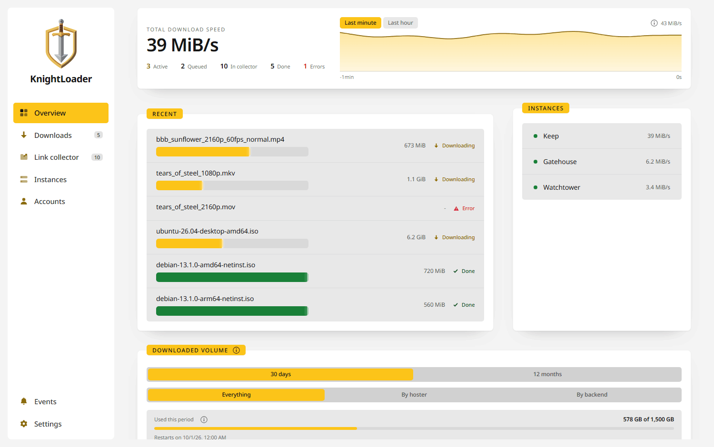
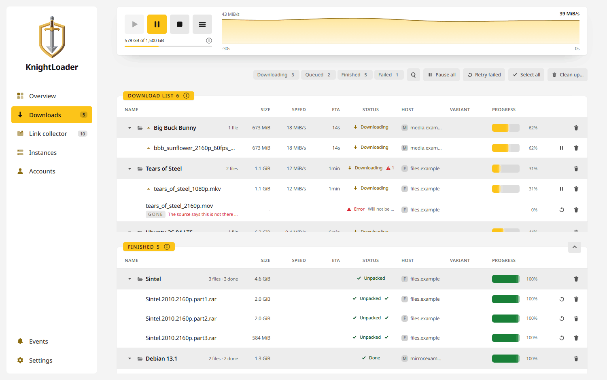
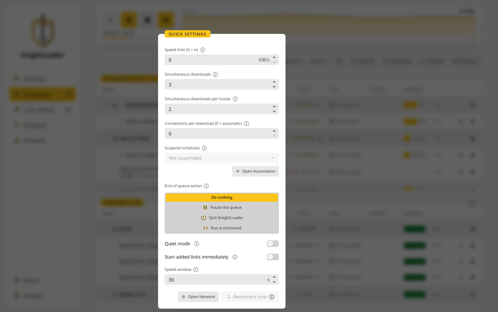
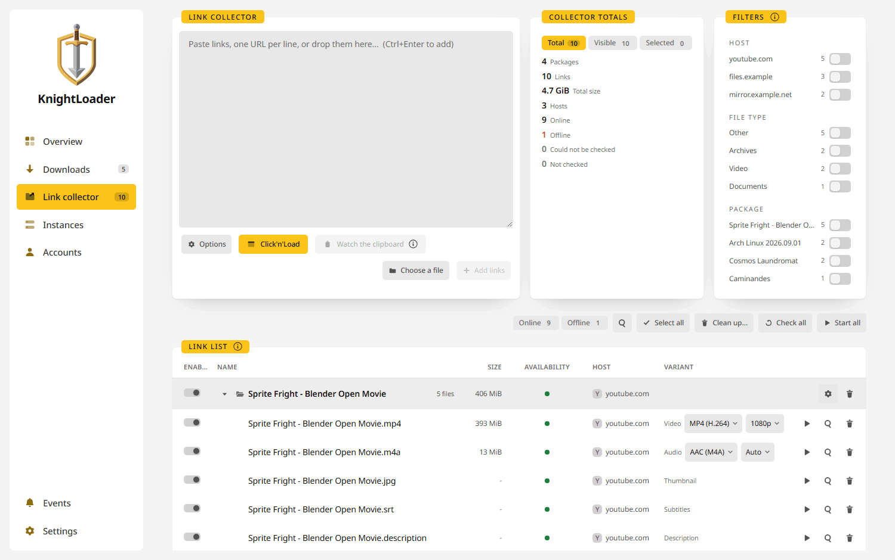
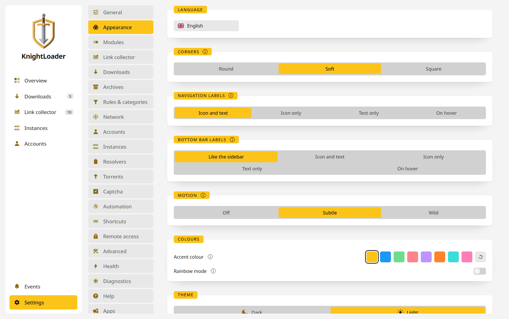
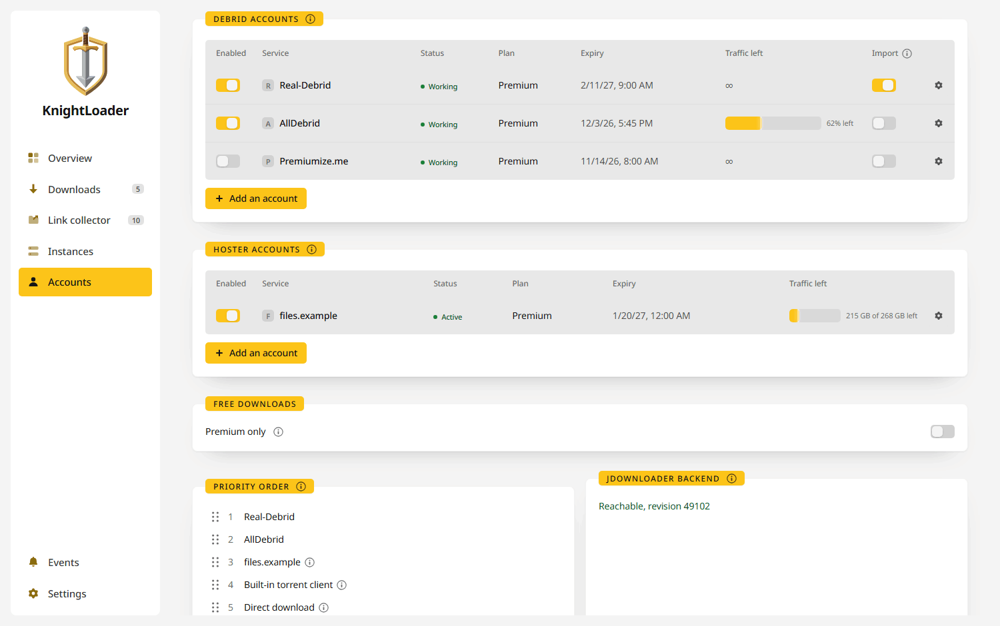
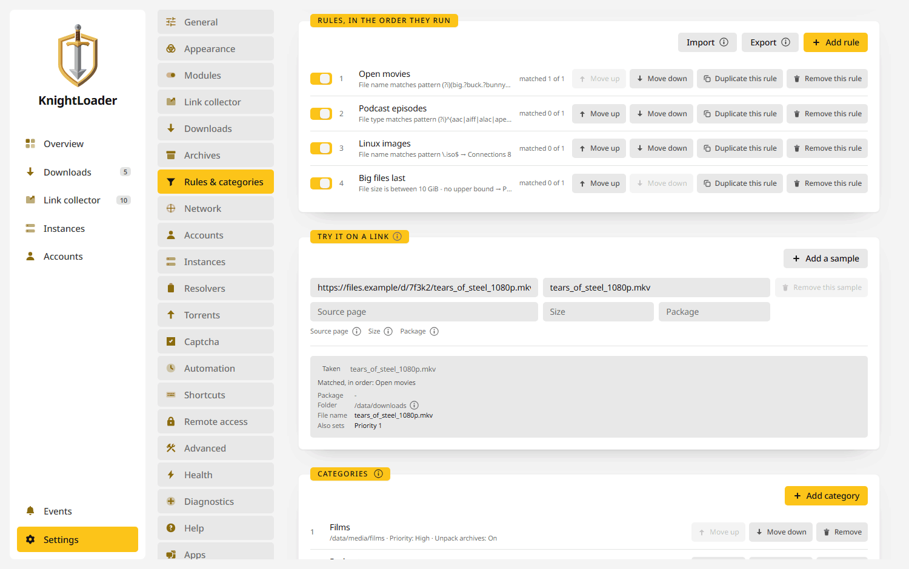
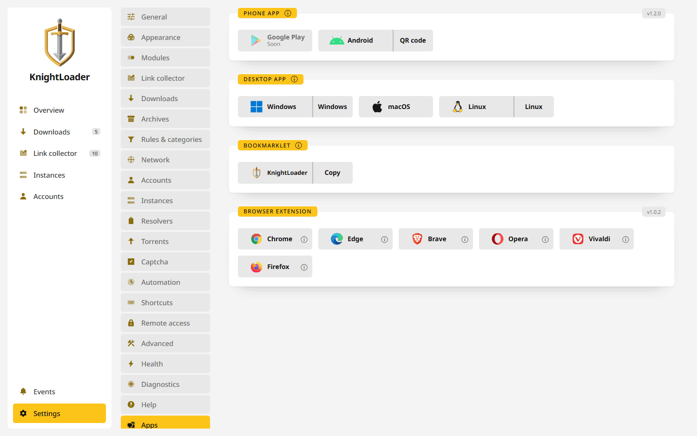
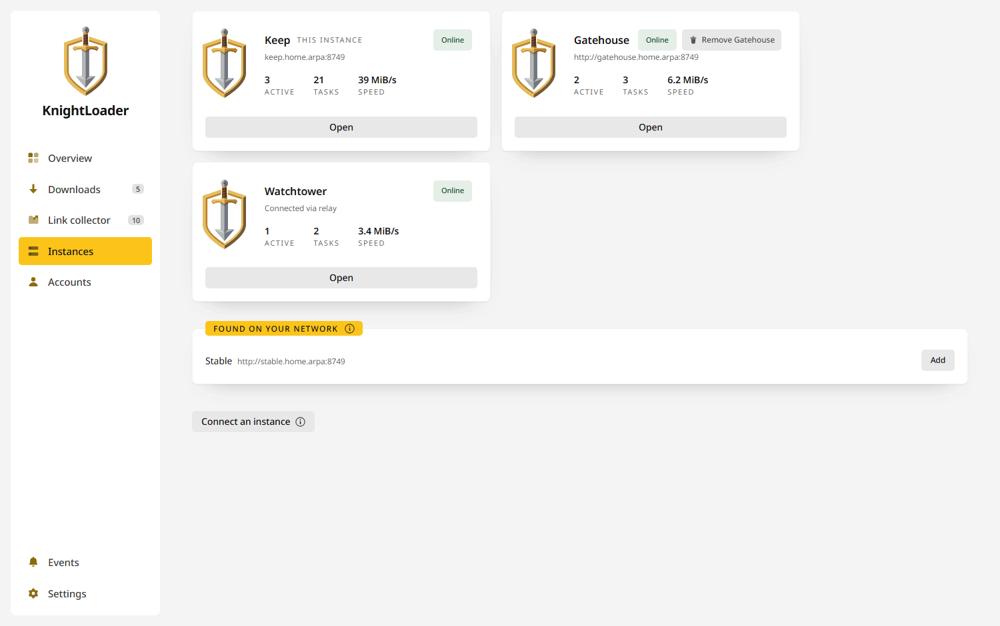

<p align="center">
  <picture>
    <source media="(prefers-color-scheme: dark)" srcset=".github/assets/knightloader-banner-dark.png">
    
  </picture>
</p>

<p align="center">
  <a href="https://github.com/junkerderprovinz/knightloader/actions/workflows/ci.yml"></a>&nbsp;
  <a href="https://github.com/junkerderprovinz/knightloader/actions/workflows/style.yml"></a>&nbsp;
  <a href="https://hub.docker.com/r/junkerderprovinz/knightloader"></a>&nbsp;
  <a href="https://hub.docker.com/r/junkerderprovinz/knightloader"></a>&nbsp;
  <a href="https://github.com/junkerderprovinz/knightloader/pkgs/container/knightloader"></a>&nbsp;
  <a href="https://go.dev"></a>&nbsp;
  <a href="https://react.dev"></a>&nbsp;
  <a href="https://wails.io"></a>&nbsp;
  <a href="https://github.com/GopeedLab/gopeed"></a>&nbsp;
  <a href="https://jdownloader.org"></a>&nbsp;
  <a href="https://github.com/yt-dlp/yt-dlp"></a>&nbsp;
  &nbsp;
  <a href="LICENSE"></a>&nbsp;
  <a href="https://junkerderprovinz.github.io/knightloader/"></a>&nbsp;
  <a href="https://github.com/junkerderprovinz/knightloader/releases"></a>
</p>

<br>

<p align="center">
<strong>KnightLoader downloads everything. Yes, everything.</strong><br>
Hosters, debrid services, torrents, Usenet, videos and streams: one download manager handles the lot, and it doesn't look like it was built in 2005. Run it on your server or your desktop, feed it links from the web, your phone or your browser, then go do something more fun.
</p>

<br>

<div align="center">

> # 🧪 In development: testers welcome
>
> **KnightLoader is still in development, so bugs can happen.**<br>
> Everyone is invited to test it and report what they find.
>
> **[Report a bug](https://github.com/junkerderprovinz/knightloader/issues/new/choose)**

</div>

<br>

<!-- download-buttons: written by scripts/gen_download_buttons.py -->
<p align="center">
  
  &nbsp;
  <a href="https://github.com/junkerderprovinz/knightloader/pkgs/container/knightloader"></a>
  &nbsp;
  <a href="https://github.com/junkerderprovinz/knightloader/releases/latest"></a>
  &nbsp;
  <a href="https://junkerderprovinz.github.io/knightloader/"></a>
</p>
<p align="center">
  <a href="https://github.com/junkerderprovinz/knightloader/releases/latest/download/knightloader-windows-amd64-installer.exe"></a><a href="https://github.com/junkerderprovinz/knightloader/releases/latest/download/knightloader-windows-arm64-installer.exe"></a>
  &nbsp;
  <a href="https://github.com/junkerderprovinz/knightloader/releases/latest/download/knightloader-macos-universal.zip"></a>
  &nbsp;
  <a href="https://github.com/junkerderprovinz/knightloader/releases/latest/download/knightloader-linux-amd64.zip"></a><a href="https://github.com/junkerderprovinz/knightloader/releases/latest/download/knightloader-linux-arm64.zip"></a>
</p>
<p align="center">
  
  &nbsp;
  <a href="https://github.com/junkerderprovinz/knightloader/releases/latest/download/knightloader-android.apk"></a>
</p>
<p align="center">
  <a href="https://chromewebstore.google.com/detail/knightloader/elofnnhhimbaeknbmncmlhhfkbncdpdf"></a>
  &nbsp;
  <a href="https://microsoftedge.microsoft.com/addons/detail/knightloader/fjmmdihlohkllidleeofpmhbekibfkfl"></a>
  &nbsp;
  <a href="https://chromewebstore.google.com/detail/knightloader/elofnnhhimbaeknbmncmlhhfkbncdpdf"></a>
</p>
<p align="center">
  <a href="https://chromewebstore.google.com/detail/knightloader/elofnnhhimbaeknbmncmlhhfkbncdpdf"></a>
  &nbsp;
  <a href="https://chromewebstore.google.com/detail/knightloader/elofnnhhimbaeknbmncmlhhfkbncdpdf"></a>
  &nbsp;
  
  <br><sub>Always downloads the latest build</sub>
</p>
<!-- /download-buttons -->

<br>

<p align="center">
A one-knight job: I build it, keep it running, work through the issues and add what people ask for, until nothing is missing. It is free, with no accounts, no ads and no paid tier, and KnightLoader collects nothing about you. One caveat: the phone app's QR scanner comes from Google and sends Google usage diagnostics when it scans a code. Nothing readable ever leaves your own walls. Forged on evenings and weekends, with heart and stubbornness.
</p>

<p align="center">
If it has earned a place on your server or computer, toss a coin to your knight: it helps cover the costs and keeps the project alive. It also makes this knight's heart beat a little faster. Three ways below, whichever suits you.
</p>

<!-- give-buttons: written by scripts/gen_download_buttons.py -->
<p align="center">
  <a href="https://buymeacoffee.com/junkerderprovinz"></a>
  &nbsp;
  <a href="https://www.paypal.com/donate/?hosted_button_id=76FVV52TKXTUS"></a>
  &nbsp;
  <a href="https://junkerderprovinz.github.io/junkerderprovinz/"></a>
</p>
<!-- /give-buttons -->

<br>

## Table of Contents

1. [Overview](#1-overview)
   - [How it compares](#how-it-compares)
2. [Screenshots](#2-screenshots)
3. [Quick Start](#3-quick-start)
4. [Documentation](#4-documentation)
5. [Contributing and license](#5-contributing-and-license)
6. [How AI is used here](#6-how-ai-is-used-here)
7. [Support this project](#7-support-this-project)

<br>

## 1. Overview

KnightLoader is one Go process. The download engine, the REST and WebSocket API,
the web UI and the Click'n'Load listener all live in the same binary, so there is
no aria2 to supervise, no separate front end to keep in step, and nothing to
install beside it.

Hoster coverage comes from swappable **resolvers** rather than from a plugin
ecosystem nobody can maintain: plain file links go straight to the embedded
engine, supported hosters are unlocked through a debrid service you already pay
for, magnets and `.torrent` files go to the BitTorrent client in the same
engine or through a debrid service that takes them, media pages and stream
playlists go to yt-dlp, and anything left over is delegated to a headless
JDownloader kept at arm's length. Your accounts stay yours, stored
encrypted on your own box.

The Packagizer, extraction, reconnect, the twelve words and everything else are
listed area by area under
[What it does](https://junkerderprovinz.github.io/knightloader/features/).

<br>

### How it compares

Every cell about another program comes from its own documentation, source code
or forum as of autumn 2026. If one has changed, please open an issue.

| | **KnightLoader** | [JDownloader 2](https://jdownloader.org/) | [pyLoad](https://pyload.net/) | [rdt-client](https://github.com/rogerfar/rdt-client) |
|---|:---:|:---:|:---:|:---:|
| Stable release | ✅ | ✅ | ❌ | ✅ |
| Open source | ✅ | ⚠️ [partly](https://board.jdownloader.org/showthread.php?p=517795#post517795) | ✅ | ✅ |
| No runtime to install | ✅ | ⚠️ Java | ❌ Python | ❌ .NET |
| Web interface | ✅ | ⚠️ online | ✅ | ✅ |
| Desktop app | ✅ | ✅ | ❌ | ❌ |
| Languages | 42 | ~38 | 1 | 1 |
| Docker image | ✅ | ⚠️ community | ⚠️ community | ✅ |
| Remote access without an account | ✅ | ❌ | ⚠️ DIY | ⚠️ DIY |
| Several instances in one place | ✅ | ⚠️ account | ❌ | ❌ |
| Debrid services | ✅ | ✅ | ✅ | ⚠️ one |
| File hosters | ⚠️ via debrid, JD | ✅ | ✅ | ❌ |
| Premium hoster logins | ⚠️ via JD | ✅ | ✅ | ❌ |
| Reconnect | ✅ | ✅ | ⚠️ script | ❌ |
| Video sites | ✅ | ✅ | ⚠️ few | ❌ |
| Torrents | ✅ | ❌ | ⚠️ via debrid | ✅ |
| Usenet | ⚠️ via debrid | ⚠️ no repair | ⚠️ via debrid | ⚠️ via debrid |
| Click'n'Load | ✅ | ✅ | ⚠️ add-on | ❌ |
| DLC, CCF, RSDF | ⚠️ via JD | ✅ | ⚠️ via JD | ❌ |
| Watched folder | ✅ | ⚠️ add-on | ⚠️ add-on | ✅ |
| Browser extension | ✅ | ⚠️ outdated | ⚠️ third-party | ⚠️ third-party |
| Phone app | ✅ | ✅ | ✅ | ❌ |
| Captchas by hand | ✅ | ✅ | ✅ | ➖ |
| Paid captcha solvers | ✅ | ✅ | ✅ | ➖ |
| Unpacking | ✅ | ✅ | ⚠️ needs unrar | ✅ |
| Checksums | ✅ | ✅ | ⚠️ add-on | ❌ |
| Link rules | ✅ | ✅ | ⚠️ basic | ⚠️ basic |
| Event scripts | ✅ | ✅ | ✅ | ⚠️ one event |
| Sonarr and Radarr | ✅ | ❌ | ❌ | ✅ |

✅ yes · ⚠️ partly · ❌ no · ➖ not needed, the debrid service fetches everything

<br>

## 2. Screenshots

Each picture follows your system's light or dark setting. The downloads, hosts
and accounts in them are made up.

<p align="center">
  <picture>
    <source media="(prefers-color-scheme: dark)" srcset=".github/assets/screenshots/knightloader-1-overview-dark.png">
    
  </picture>
  <br><em>Overview: one number that matters, and what is happening under it.</em>
</p>

<br>

<p align="center">
  <picture>
    <source media="(prefers-color-scheme: dark)" srcset=".github/assets/screenshots/knightloader-2-downloads-dark.png">
    
  </picture>
  <br><em>Downloads, grouped by package, under the queue controls and the speed curve.</em>
</p>

<br>

<p align="center">
  <picture>
    <source media="(prefers-color-scheme: dark)" srcset=".github/assets/screenshots/knightloader-3-quick-settings-dark.png">
    
  </picture>
  <br><em>Quick settings: the limits you change most often, one click from the download list.</em>
</p>

<br>

<p align="center">
  <picture>
    <source media="(prefers-color-scheme: dark)" srcset=".github/assets/screenshots/knightloader-4-collector-dark.png">
    
  </picture>
  <br><em>The link collector: one YouTube link as video, audio, thumbnail, subtitles and description. Format and quality are picked on the row.</em>
</p>

<br>

<p align="center">
  <picture>
    <source media="(prefers-color-scheme: dark)" srcset=".github/assets/screenshots/knightloader-5-appearance-dark.png">
    
  </picture>
  <br><em>Appearance: corners, labels, motion, colours and the theme.</em>
</p>

<br>

<p align="center">
  <picture>
    <source media="(prefers-color-scheme: dark)" srcset=".github/assets/screenshots/knightloader-6-accounts-dark.png">
    
  </picture>
  <br><em>Accounts: debrid services and hoster logins, and the order they are asked in.</em>
</p>

<br>

<p align="center">
  <picture>
    <source media="(prefers-color-scheme: dark)" srcset=".github/assets/screenshots/knightloader-7-rules-dark.png">
    
  </picture>
  <br><em>Rules &amp; categories: rules sort links as they arrive, and the test box shows what they would do to one.</em>
</p>

<br>

<p align="center">
  <picture>
    <source media="(prefers-color-scheme: dark)" srcset=".github/assets/screenshots/knightloader-8-app-dark.png">
    
  </picture>
  <br><em>The Apps tab: the phone app, the desktop builds, the bookmarklet and the browser extension.</em>
</p>

<br>

<p align="center">
  <picture>
    <source media="(prefers-color-scheme: dark)" srcset=".github/assets/screenshots/knightloader-9-instances-dark.png">
    
  </picture>
  <br><em>Instances: your other KnightLoaders, at home or through the relay, and the ones found on your network.</em>
</p>

<br>

## 3. Quick Start

Every release tag publishes `ghcr.io/junkerderprovinz/knightloader` for amd64
and arm64:

```sh
docker run -d --name knightloader \
  --restart unless-stopped \
  -p 8749:8749 \
  -v /path/to/appdata:/data \
  -v /path/to/downloads:/data/downloads \
  -e TZ=Europe/Berlin \
  ghcr.io/junkerderprovinz/knightloader:latest
```

On Unraid, add `--user 99:100` and `-e UMASK=000`, so the account you use over
SMB can move and delete what KnightLoader downloads.

Then open `http://<host>:8749`. The desktop apps, the Android app and the
browser extension are covered under
[Installing](https://junkerderprovinz.github.io/knightloader/installing/). On
Windows the installer puts KnightLoader under Program Files for everyone on the
computer, and a scheduled task running as the system account keeps it up to
date, whether the app is open or not.

<br>

## 4. Documentation

The manual lives at
**[junkerderprovinz.github.io/knightloader](https://junkerderprovinz.github.io/knightloader/)**:

- [Installing](https://junkerderprovinz.github.io/knightloader/installing/) the container, a desktop app, the Android app or the browser extension
- [What it does](https://junkerderprovinz.github.io/knightloader/features/), area by area
- [Configuration](https://junkerderprovinz.github.io/knightloader/configuration/): the environment variables
- [Getting links in](https://junkerderprovinz.github.io/knightloader/getting-links-in/): watched folders, container files, your own servers, header profiles
- [Click'n'Load](https://junkerderprovinz.github.io/knightloader/clicknload/) and the [browser extension](https://junkerderprovinz.github.io/knightloader/browser-tools/)
- [Connecting instances and apps](https://junkerderprovinz.github.io/knightloader/connecting/) with the twelve words
- [Where files land](https://junkerderprovinz.github.io/knightloader/where-files-land/): folder templates and library rescans
- [Architecture](https://junkerderprovinz.github.io/knightloader/architecture/) and [building and testing](https://junkerderprovinz.github.io/knightloader/development/)

<br>

## 5. Contributing and license

[AGPL-3.0](LICENSE). Own code; the name and branding are reserved.

Built on [Gopeed](https://github.com/GopeedLab/gopeed) (download engine),
[yt-dlp](https://github.com/yt-dlp/yt-dlp) (media),
[JDownloader](https://jdownloader.org/) (hoster catch-all, via its local API),
[Wails](https://github.com/wailsapp/wails) (desktop) and
[React](https://react.dev) with [Tailwind](https://tailwindcss.com).

<br>

## 6. How AI is used here

One knight builds this, and AI is one of the tools I work with, the same way I work with an editor or a compiler. It helps me write code and documentation and it checks my work, and that saves me a good many evenings. It does not make the decisions, though. I read and understand everything before it ships, and if something here breaks, that is on me and not on the tool.

You do not have to take my word for it. The code is open and every release note is written by hand. The issue tracker shows how problems actually get handled, including the ones I got wrong the first time. If you find something that is not right, open an issue and I will look at it.

<br>

## 7. Support this project

A one-knight job: I build it, keep it running, work through the issues and add what people ask for, until nothing is missing. It is free, with no accounts, no ads and no paid tier, and KnightLoader collects nothing about you. One caveat: the phone app's QR scanner comes from Google and sends Google usage diagnostics when it scans a code. Nothing readable ever leaves your own walls. Forged on evenings and weekends, with heart and stubbornness.

If it has earned a place on your server or computer, toss a coin to your knight: it helps cover the costs and keeps the project alive. It also makes this knight's heart beat a little faster. Three ways below, whichever suits you.

<!-- give-buttons: written by scripts/gen_download_buttons.py -->
<p align="center">
  <a href="https://buymeacoffee.com/junkerderprovinz"></a>
  &nbsp;
  <a href="https://www.paypal.com/donate/?hosted_button_id=76FVV52TKXTUS"></a>
  &nbsp;
  <a href="https://junkerderprovinz.github.io/junkerderprovinz/"></a>
</p>
<!-- /give-buttons -->

Problems, wishes or suggestions? Don't hesitate to open an [issue](https://github.com/junkerderprovinz/knightloader/issues).
