<p align="center">
  <picture>
    <source media="(prefers-color-scheme: dark)" srcset=".github/assets/knightloader-banner-dark.png">
    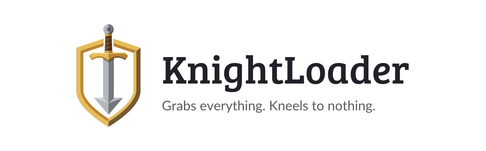
  </picture>
</p>

<p align="center">
  <a href="https://github.com/junkerderprovinz/knightloader/actions/workflows/ci.yml"></a>&nbsp;
  <a href="https://github.com/junkerderprovinz/knightloader/actions/workflows/style.yml"></a>&nbsp;
  <a href="https://hub.docker.com/r/junkerderprovinz/knightloader"></a>&nbsp;
  <a href="https://hub.docker.com/r/junkerderprovinz/knightloader"></a>&nbsp;
  <a href="https://github.com/junkerderprovinz/knightloader/pkgs/container/knightloader"></a>&nbsp;
  <a href="https://go.dev"></a>&nbsp;
  <a href="https://react.dev"></a>&nbsp;
  <a href="https://wails.io"></a>&nbsp;
  <a href="https://github.com/GopeedLab/gopeed"></a>&nbsp;
  <a href="https://jdownloader.org"></a>&nbsp;
  <a href="https://github.com/yt-dlp/yt-dlp"></a>&nbsp;
  &nbsp;
  <a href="LICENSE"></a>&nbsp;
  <a href="https://junkerderprovinz.github.io/knightloader/"></a>&nbsp;
  <a href="https://github.com/junkerderprovinz/knightloader/releases"></a>
</p>

<br>

<p align="center">
<strong>KnightLoader downloads everything. Yes, everything.</strong><br>
Hosters, debrid services, torrents, Usenet, videos and streams: one download manager handles the lot, and it doesn't look like it was built in 2005. Run it on your server or your desktop, feed it links from the web, your phone or your browser, then go do something more fun.
</p>

<br>

<p align="center">
  <a href="https://github.com/junkerderprovinz/knightloader/issues/new/choose">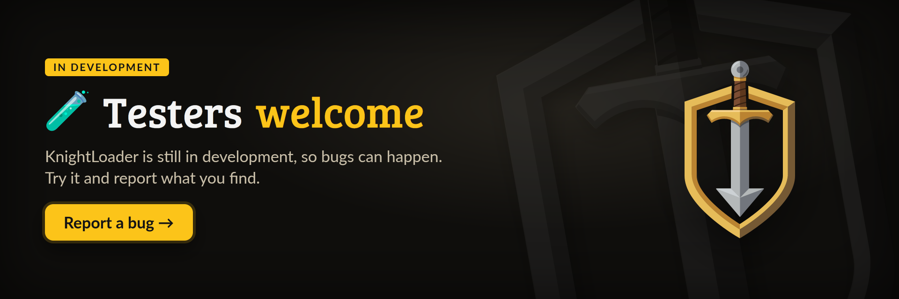</a>
</p>

<br>

<p align="center">
  <a href="https://play.google.com/apps/testing/knightloader.halleluja.design">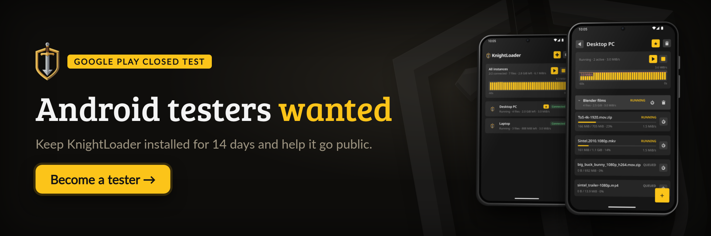</a>
</p>

> [!IMPORTANT]
> **Android testers wanted.** Google Play only lists an app from a new developer account after at least 12 testers have kept it installed for 14 days. If you have an Android phone:
>
> 1. Join the [tester group](https://groups.google.com/g/arrowloop-testers).
> 2. Open the [test page](https://play.google.com/apps/testing/knightloader.halleluja.design) and tap **Become a tester**.
> 3. Install KnightLoader from Google Play and keep it for 14 days. Using it for real helps most, and anything that goes wrong is welcome as an [issue](https://github.com/junkerderprovinz/knightloader/issues).

<br>

<!-- download-buttons: written by scripts/gen_download_buttons.py -->
<p align="center">
  
  &nbsp;
  <a href="https://github.com/junkerderprovinz/knightloader/pkgs/container/knightloader"></a>
  &nbsp;
  <a href="https://github.com/junkerderprovinz/knightloader/releases/latest"></a>
  &nbsp;
  <a href="https://junkerderprovinz.github.io/knightloader/"></a>
</p>
<br>
<p align="center">
  <a href="https://github.com/junkerderprovinz/knightloader/releases/latest/download/knightloader-windows-amd64-installer.exe"></a><a href="https://github.com/junkerderprovinz/knightloader/releases/latest/download/knightloader-windows-arm64-installer.exe"></a>
  &nbsp;
  <a href="https://github.com/junkerderprovinz/knightloader/releases/latest/download/knightloader-macos-universal.zip"></a>
  &nbsp;
  <a href="https://github.com/junkerderprovinz/knightloader/releases/latest/download/knightloader-linux-amd64.zip"></a><a href="https://github.com/junkerderprovinz/knightloader/releases/latest/download/knightloader-linux-arm64.zip"></a>
</p>
<br>
<p align="center">
  
  &nbsp;
  <a href="https://github.com/junkerderprovinz/knightloader/releases/latest/download/knightloader-android.apk"></a>
  <br><sub>Always downloads the latest build</sub>
</p>
<br>
<p align="center">
  <a href="https://chromewebstore.google.com/detail/knightloader/elofnnhhimbaeknbmncmlhhfkbncdpdf"></a>
  &nbsp;
  <a href="https://microsoftedge.microsoft.com/addons/detail/knightloader/fjmmdihlohkllidleeofpmhbekibfkfl"></a>
  &nbsp;
  <a href="https://chromewebstore.google.com/detail/knightloader/elofnnhhimbaeknbmncmlhhfkbncdpdf"></a>
  &nbsp;
  <a href="https://chromewebstore.google.com/detail/knightloader/elofnnhhimbaeknbmncmlhhfkbncdpdf"></a>
</p>
<p align="center">
  <a href="https://chromewebstore.google.com/detail/knightloader/elofnnhhimbaeknbmncmlhhfkbncdpdf"></a>
  &nbsp;
  
</p>
<br>
<p align="center">
  <a href="https://github.com/junkerderprovinz/parleyport"></a>
</p>
<!-- /download-buttons -->

<br>

<p align="center">
A one-knight job: I build it, keep it running, work through the issues and add what people ask for, until nothing is missing. It is free, with no accounts, no ads and no paid tier, and KnightLoader collects nothing about you. One caveat: the phone app's QR scanner comes from Google and sends Google usage diagnostics when it scans a code. Nothing readable ever leaves your own walls. Forged on evenings and weekends, with heart and stubbornness.
</p>

<p align="center">
If it has earned a place on your server or computer, toss a coin to your knight: it helps cover the costs and keeps the project alive. It also makes this knight's heart beat a little faster. Three ways below, whichever suits you.
</p>

<!-- give-buttons: written by scripts/gen_download_buttons.py -->
<p align="center">
  <a href="https://buymeacoffee.com/junkerderprovinz"></a>
  &nbsp;
  <a href="https://www.paypal.com/donate/?hosted_button_id=76FVV52TKXTUS"></a>
  &nbsp;
  <a href="https://junkerderprovinz.github.io/junkerderprovinz/"></a>
</p>
<!-- /give-buttons -->

<br>

## Table of Contents

1. [Screenshots](#1-screenshots)
2. [What it does](#2-what-it-does)
3. [How it compares](#3-how-it-compares)
4. [Getting started](#4-getting-started)
5. [Documentation](#5-documentation)
6. [How AI is used here](#6-how-ai-is-used-here)
7. [Support this project](#7-support-this-project)

<br>

## 1. Screenshots

The downloads, hosts and accounts in these pictures are made up.

<p align="center">
  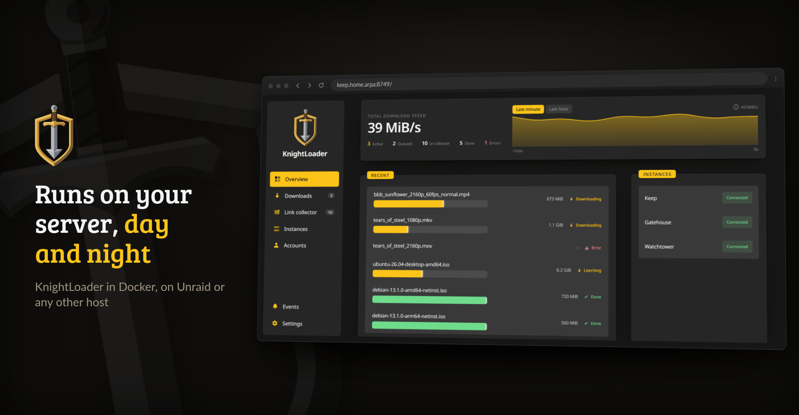
  <br><em>The web interface from the container, in any browser on your network.</em>
</p>

<br>

<p align="center">
  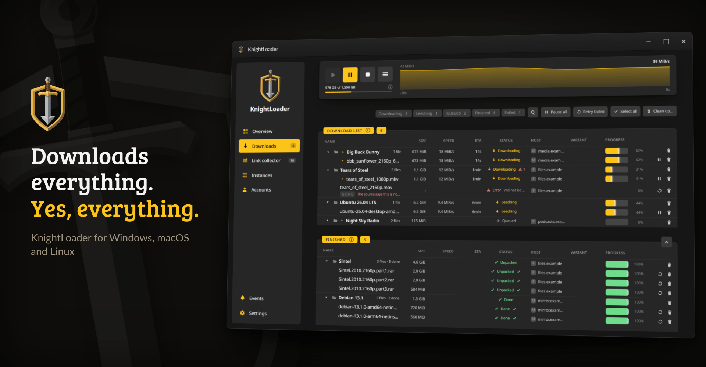
  <br><em>The same interface as a desktop app for Windows, macOS and Linux.</em>
</p>

<br>

<p align="center">
  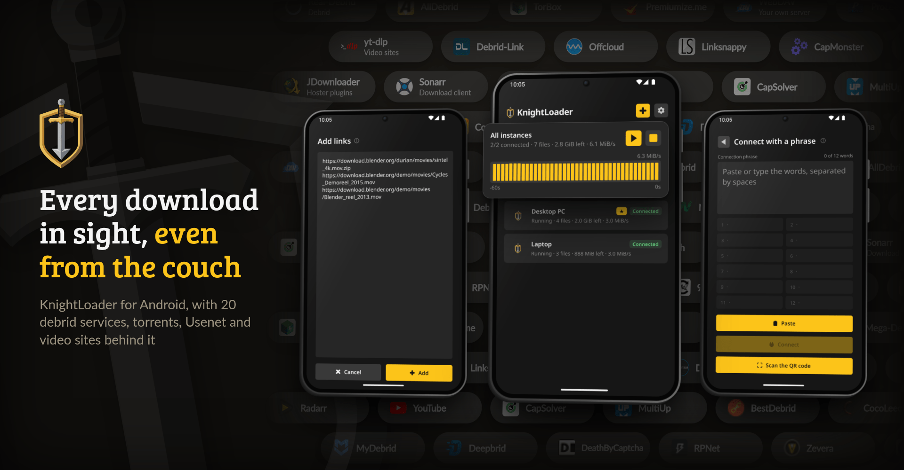
  <br><em>The Android app: a remote for every KnightLoader you run.</em>
</p>

<br>

<p align="center">
  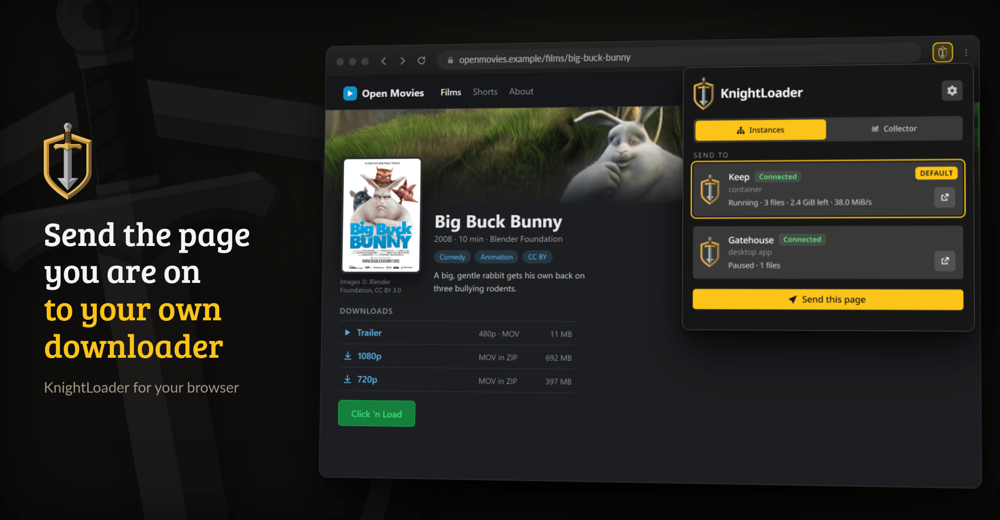
  <br><em>The browser extension sends the page you are on, a link or a Click'n'Load button to the instance you pick.</em>
</p>

<br>

<p align="center">
  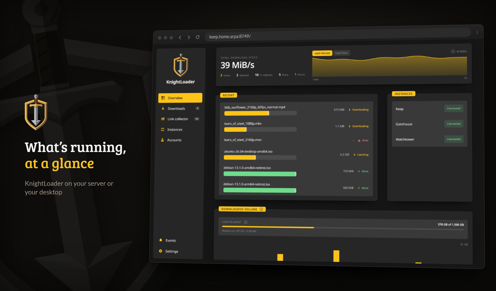
  <br><em>Overview: one number that matters, and what is happening under it.</em>
</p>

<br>

<p align="center">
  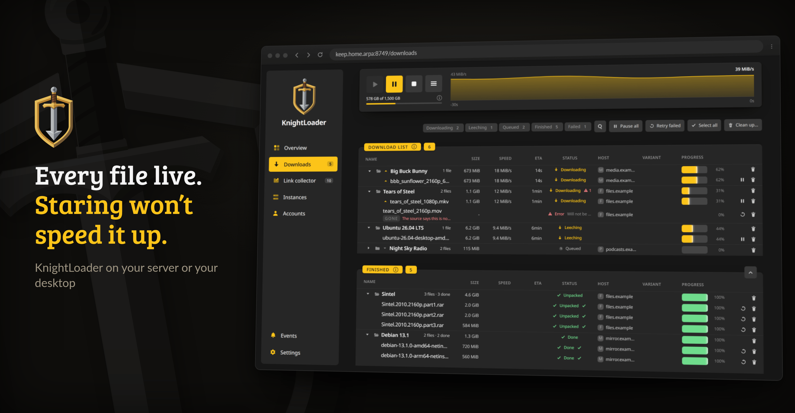
  <br><em>Downloads, grouped by package, under the queue controls and the speed curve.</em>
</p>

<br>

<p align="center">
  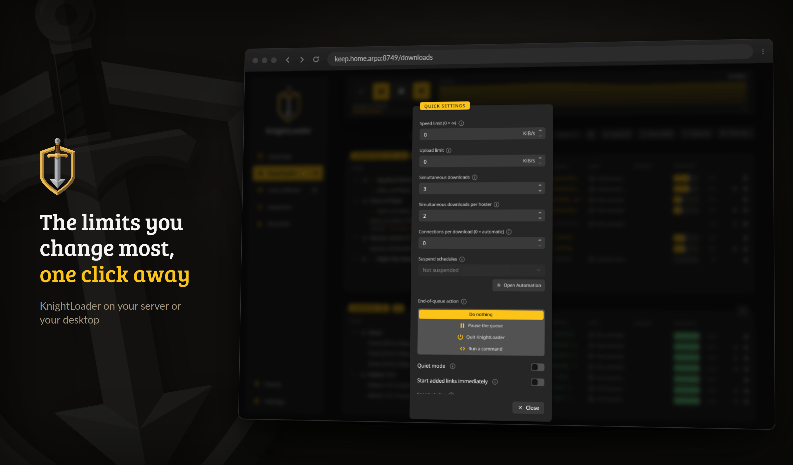
  <br><em>Quick settings: the limits you change most often, one click from the download list.</em>
</p>

<br>

<p align="center">
  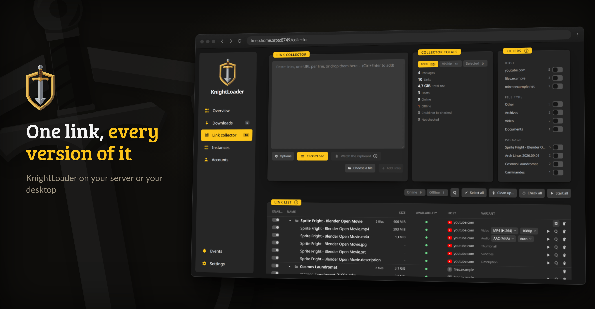
  <br><em>The link collector: one YouTube link as video, audio, thumbnail, subtitles and description. Format and quality are picked on the row.</em>
</p>

<br>

<p align="center">
  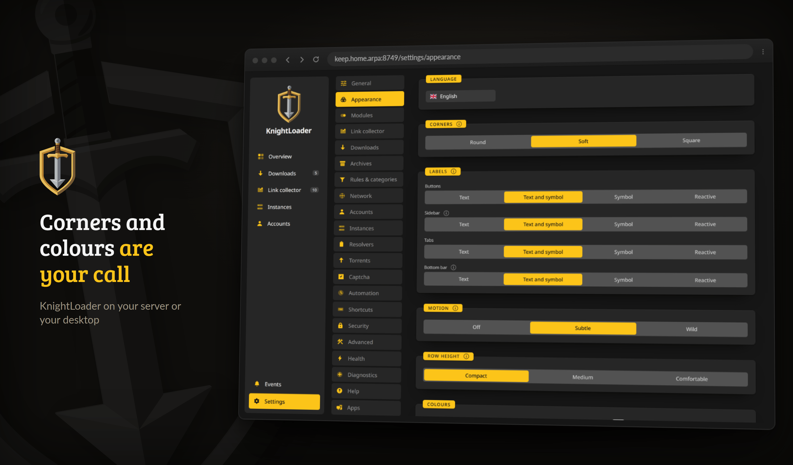
  <br><em>Appearance: corners, labels, motion, colours and the theme.</em>
</p>

<br>

<p align="center">
  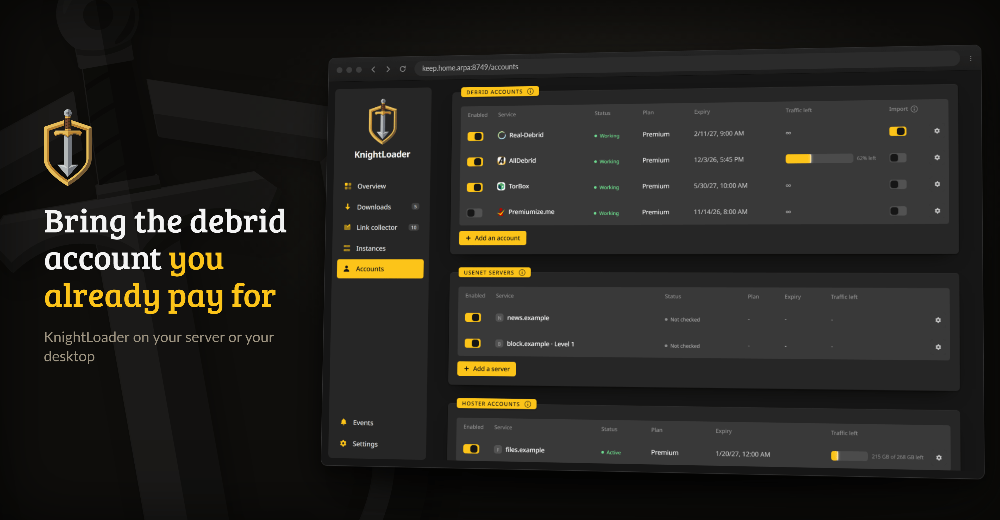
  <br><em>Accounts: debrid services, your own Usenet servers and hoster logins.</em>
</p>

<br>

<p align="center">
  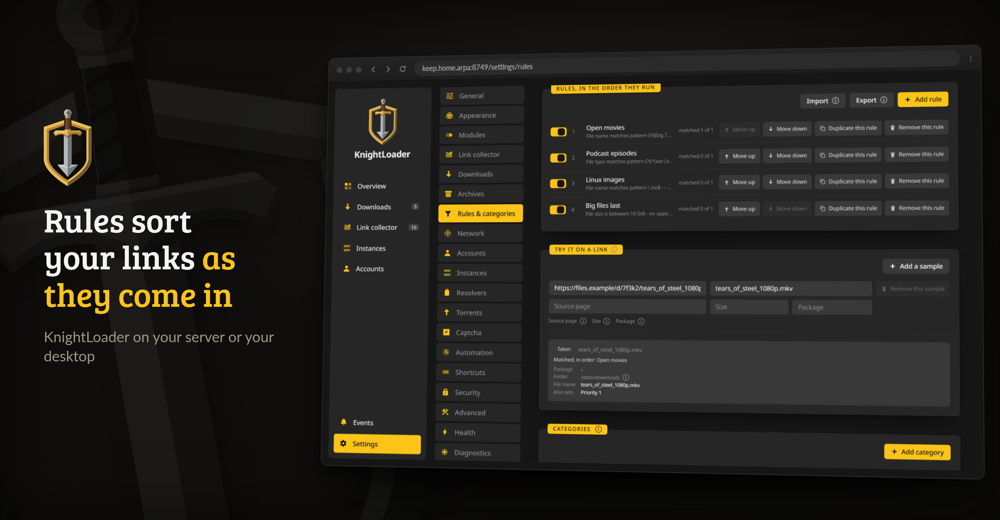
  <br><em>Rules &amp; categories: rules sort links as they arrive, and the test box shows what they would do to one.</em>
</p>

<br>

<p align="center">
  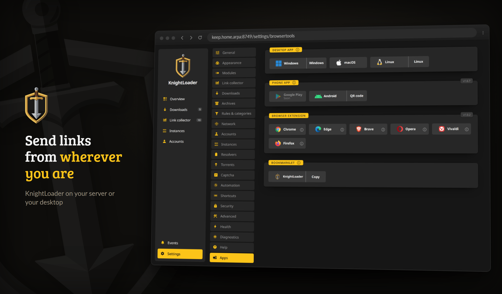
  <br><em>The Apps tab: the desktop builds, the phone app, the browser extension and the bookmarklet.</em>
</p>

<br>

<p align="center">
  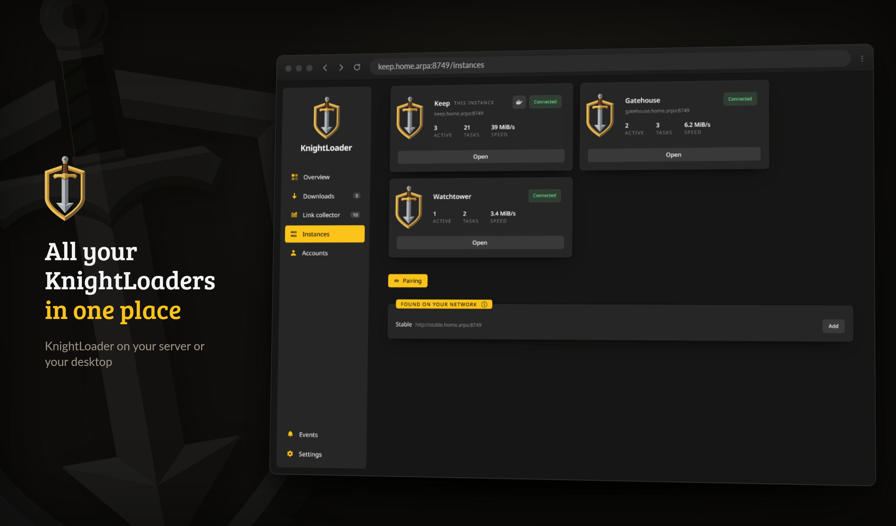
  <br><em>Instances: your other KnightLoaders, at home or through the relay, and the ones found on your network.</em>
</p>

<br>

## 2. What it does

KnightLoader is one Go process. The download engine, the API, the web interface and the Click'n'Load listener live in the same binary, so there is nothing to install beside it.

- **Hosters, torrents, Usenet and video.** Hoster links go through the debrid service you already pay for, torrents to the built-in client or a debrid service, `.nzb` files to TorBox or Premiumize.me, videos and streams to yt-dlp, and whatever is left to a headless JDownloader. [Getting links in](https://junkerderprovinz.github.io/knightloader/getting-links-in/)
- **A look before anything downloads.** The collector checks each link and shows which backend will take it, and Packagizer rules sort links into packages and folders as they arrive. A link nothing can fetch stays in the list, with the reason. [What it does](https://junkerderprovinz.github.io/knightloader/features/)
- **Links from anywhere.** Paste them, click a site's Click'n'Load button, send them from the browser extension or the phone's share sheet, drop them in a watched folder, or let Sonarr and Radarr send them, since they see KnightLoader as qBittorrent or SABnzbd. [Bookmarklet, extension and share target](https://junkerderprovinz.github.io/knightloader/browser-tools/)
- **When a download finishes.** Archives are unpacked and checksums checked, files land in folders built from templates, and a media library can be told to rescan. [Where files land](https://junkerderprovinz.github.io/knightloader/where-files-land/)
- **Twelve words instead of a port forward.** Instances, the phone app and the browser extension find each other with a phrase, across networks, without an account or a domain. [Connecting instances and apps](https://junkerderprovinz.github.io/knightloader/connecting/)
- **Wherever you need it.** A container for your server or Unraid, a desktop app for Windows, macOS and Linux, an Android app and a browser extension. [Installing](https://junkerderprovinz.github.io/knightloader/installing/)
- **Coming from JDownloader?** KnightLoader takes over your accounts, rules, archive passwords and the open download list, with a preview first. [Moving over from JDownloader](https://junkerderprovinz.github.io/knightloader/from-jdownloader/)

Reconnect, captcha accounts, programs on events and the rest are listed area by area under [What it does](https://junkerderprovinz.github.io/knightloader/features/).

<br>

## 3. How it compares

Every cell about another program comes from its own documentation, source code
or forum as of autumn 2026. If one has changed, please open an issue.

| | **KnightLoader** | [JDownloader 2](https://jdownloader.org/) | [pyLoad](https://pyload.net/) | [rdt-client](https://github.com/rogerfar/rdt-client) |
|---|:---:|:---:|:---:|:---:|
| Stable release | ✅ | ✅ | ❌ | ✅ |
| Open source | ✅ | ⚠️ [partly](https://board.jdownloader.org/showthread.php?p=517795#post517795) | ✅ | ✅ |
| No runtime to install | ✅ | ⚠️ Java | ❌ Python | ❌ .NET |
| Web interface | ✅ | ⚠️ online | ✅ | ✅ |
| Desktop app | ✅ | ✅ | ❌ | ❌ |
| Languages | 42 | ~38 | 1 | 1 |
| Docker image | ✅ | ⚠️ community | ⚠️ community | ✅ |
| Remote access without an account | ✅ | ❌ | ⚠️ DIY | ⚠️ DIY |
| Several instances in one place | ✅ | ⚠️ account | ❌ | ❌ |
| Debrid services | ✅ | ✅ | ✅ | ⚠️ one |
| File hosters | ⚠️ via debrid | ✅ | ✅ | ❌ |
| Premium hoster logins | ⚠️ via JD | ✅ | ✅ | ❌ |
| Reconnect | ✅ | ✅ | ⚠️ script | ❌ |
| Video sites | ✅ | ✅ | ⚠️ few | ❌ |
| Torrents | ✅ | ❌ | ⚠️ via debrid | ✅ |
| Usenet | ⚠️ no repair yet | ⚠️ no repair | ⚠️ via debrid | ⚠️ via debrid |
| Click'n'Load | ✅ | ✅ | ⚠️ add-on | ❌ |
| DLC, CCF, RSDF | ⚠️ DLC via JD | ✅ | ⚠️ via JD | ❌ |
| Watched folder | ✅ | ⚠️ add-on | ⚠️ add-on | ✅ |
| Browser extension | ✅ | ⚠️ outdated | ⚠️ third-party | ⚠️ third-party |
| Phone app | ✅ | ✅ | ✅ | ❌ |
| Captchas by hand | ✅ | ✅ | ✅ | ➖ |
| Paid captcha solvers | ✅ | ✅ | ✅ | ➖ |
| Unpacking | ✅ | ✅ | ⚠️ needs unrar | ✅ |
| Checksums | ✅ | ✅ | ⚠️ add-on | ❌ |
| Link rules | ✅ | ✅ | ⚠️ basic | ⚠️ basic |
| Event scripts | ✅ | ✅ | ✅ | ⚠️ one event |
| Sonarr and Radarr | ✅ | ❌ | ❌ | ✅ |

✅ yes · ⚠️ partly · ❌ no · ➖ not needed, the debrid service fetches everything

<br>

## 4. Getting started

On a server, one container is enough. Every release tag publishes `ghcr.io/junkerderprovinz/knightloader` for amd64 and arm64:

```sh
docker run -d --name knightloader \
  --restart unless-stopped \
  -p 8749:8749 \
  -v /path/to/appdata:/data \
  -v /path/to/downloads:/data/downloads \
  -e TZ=Europe/Berlin \
  ghcr.io/junkerderprovinz/knightloader:latest
```

On Unraid, add `--user 99:100` and `-e UMASK=000`, so the account you use over SMB can move and delete what KnightLoader downloads.

Then open `http://<host>:8749`. The desktop apps, the Android app and the browser extension are the buttons above. Reverse proxies, updates and building it yourself are covered in the [installation guide](https://junkerderprovinz.github.io/knightloader/installing/).

<br>

## 5. Documentation

The manual lives at
**[junkerderprovinz.github.io/knightloader](https://junkerderprovinz.github.io/knightloader/)**:

- [Installing](https://junkerderprovinz.github.io/knightloader/installing/) the container, a desktop app, the Android app or the browser extension
- [What it does](https://junkerderprovinz.github.io/knightloader/features/), area by area
- [Configuration](https://junkerderprovinz.github.io/knightloader/configuration/): the environment variables
- [Getting links in](https://junkerderprovinz.github.io/knightloader/getting-links-in/): watched folders, container files, your own servers, header profiles
- [Moving over from JDownloader](https://junkerderprovinz.github.io/knightloader/from-jdownloader/): accounts, rules, passwords and the open download list
- [Click'n'Load](https://junkerderprovinz.github.io/knightloader/clicknload/) and the [browser extension](https://junkerderprovinz.github.io/knightloader/browser-tools/)
- [Connecting instances and apps](https://junkerderprovinz.github.io/knightloader/connecting/) with the twelve words
- [Where files land](https://junkerderprovinz.github.io/knightloader/where-files-land/): folder templates and library rescans
- [Architecture](https://junkerderprovinz.github.io/knightloader/architecture/) and [building and testing](https://junkerderprovinz.github.io/knightloader/development/)

<br>

## 6. How AI is used here

One knight builds this, and AI is one of the tools I work with, the same way I work with an editor or a compiler. It helps me write code and documentation and it checks my work, and that saves me a good many evenings. It does not make the decisions, though. I read and understand everything before it ships, and if something here breaks, that is on me and not on the tool.

You do not have to take my word for it. The code is open and every release note is written by hand. The issue tracker shows how problems actually get handled, including the ones I got wrong the first time. If you find something that is not right, open an issue and I will look at it.

<br>

## 7. Support this project

A one-knight job: I build it, keep it running, work through the issues and add what people ask for, until nothing is missing. It is free, with no accounts, no ads and no paid tier, and KnightLoader collects nothing about you. One caveat: the phone app's QR scanner comes from Google and sends Google usage diagnostics when it scans a code. Nothing readable ever leaves your own walls. Forged on evenings and weekends, with heart and stubbornness.

If it has earned a place on your server or computer, toss a coin to your knight: it helps cover the costs and keeps the project alive. It also makes this knight's heart beat a little faster. Three ways below, whichever suits you.

<!-- give-buttons: written by scripts/gen_download_buttons.py -->
<p align="center">
  <a href="https://buymeacoffee.com/junkerderprovinz"></a>
  &nbsp;
  <a href="https://www.paypal.com/donate/?hosted_button_id=76FVV52TKXTUS"></a>
  &nbsp;
  <a href="https://junkerderprovinz.github.io/junkerderprovinz/"></a>
</p>
<!-- /give-buttons -->

Problems, wishes or suggestions? Don't hesitate to open an [issue](https://github.com/junkerderprovinz/knightloader/issues).

The code and the knight logo are licensed under [AGPL-3.0](LICENSE). The RSDF and CCF readers follow [JDownloader](https://jdownloader.org/)'s GPL-3.0 container plugins. The KnightLoader name and logo stay my trademarks, so a fork needs a name and logo of its own.
